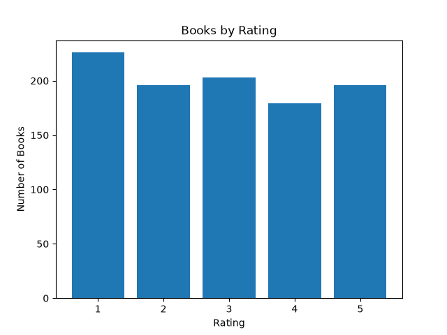
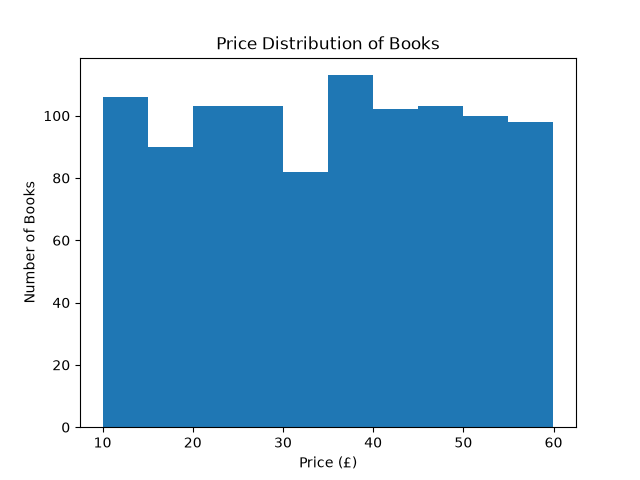
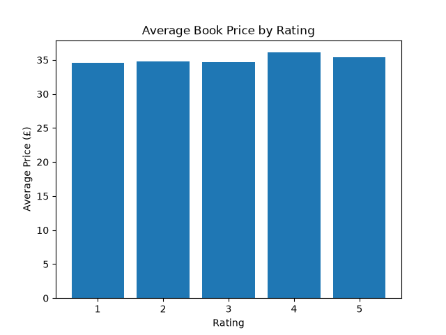

# Web Scraping and Book Price Analysis

## 📌 Project Overview

This project demonstrates how to scrape book data from a public website using Python and analyze the collected dataset using Pandas and Matplotlib.

The project collects information about 1,000 books, cleans the data, performs basic analysis, and creates visualizations to understand book prices and ratings.

## 🎯 Objectives

* Extract data from a public website using Python.
* Understand HTML structure and web scraping.
* Collect data from multiple pages.
* Clean and organize the scraped data.
* Perform basic data analysis.
* Create visualizations from the collected data.
* Create a custom dataset for analysis.

## 🛠️ Technologies Used

* Python
* Requests
* BeautifulSoup
* Pandas
* Matplotlib

## 📊 Data Collected

The dataset contains 1,000 books with the following columns:

| Column       | Description                 |
| ------------ | --------------------------- |
| Title        | Name of the book            |
| Price        | Price of the book in pounds |
| Rating       | Book rating from 1 to 5     |
| Availability | Availability status         |
| URL          | Book webpage URL            |

## 🔍 Data Collection

The data was collected from:

**Books to Scrape**

The scraper uses the `requests` library to retrieve webpage content and `BeautifulSoup` to extract book information from the HTML structure.

The scraper automatically navigates through the available pages and collects the book details.

## 🧹 Data Cleaning

The following cleaning operations were performed:

* Removed currency symbols from the price column.
* Converted prices into numeric values.
* Converted ratings from text values to numbers.
* Checked for missing values.
* Saved the cleaned dataset as a CSV file.

## 📈 Analysis Performed

The project performs the following analysis:

* Dataset shape
* Column information
* First five rows
* Average book price
* Minimum book price
* Maximum book price
* Number of books by rating
* Top 10 most expensive books
* Top 10 cheapest books
* Average price by rating

## 📊 Visualizations

### 1. Books by Rating



### 2. Price Distribution of Books



### 3. Average Book Price by Rating



## 💡 Key Findings

* The dataset contains 1,000 books.
* Book prices range from £10.00 to £59.99.
* The average book price is approximately £35.07.
* There are 226 books with a 1-star rating.
* There are 196 books with a 2-star rating.
* There are 203 books with a 3-star rating.
* There are 179 books with a 4-star rating.
* There are 196 books with a 5-star rating.
* Average prices across rating levels are relatively similar, ranging from approximately £34.56 to £36.09.

## ▶️ How to Run the Project

### 1. Clone the repository

```bash
git clone https://github.com/nagidisalmonraju-hash/data-analytics-internship.git
```

### 2. Open the project folder

Open the `data-analytics-internship` folder in VS Code.

### 3. Install the required libraries

```bash
pip install -r requirements.txt
```

### 4. Run the web scraper

```bash
python scraper.py
```

This will scrape the book data and save the cleaned dataset as:

```text
data/books.csv
```

### 5. Run the analysis

```bash
python analysis.py
```

This will display the analysis results and generate the visualizations in the `images/` folder.

## 📁 Project Structure

```text
data-analytics-internship/
│
├── data/
│   └── books.csv
│
├── images/
│   ├── books_by_rating.png
│   ├── price_distribution.png
│   └── average_price_by_rating.png
│
├── scraper.py
├── analysis.py
├── requirements.txt
└── README.md
```

## 👨‍💻 Author

**Salmon Raju**

CSE (AI & ML) Student | Aspiring Data Analyst
